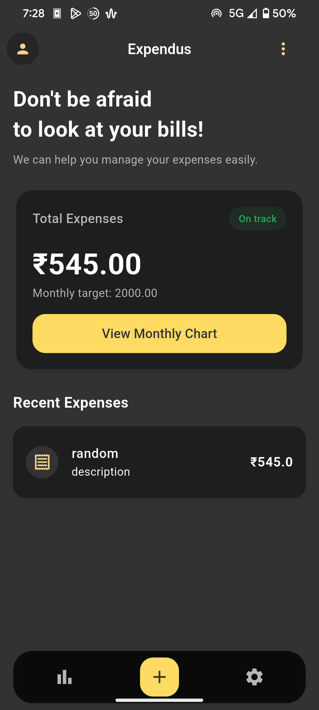
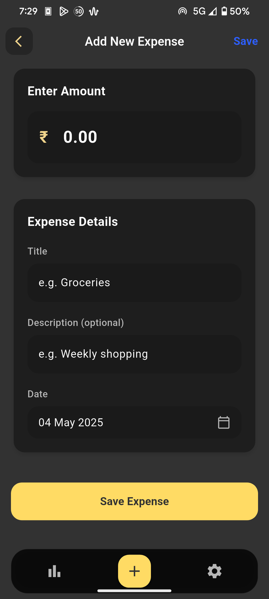
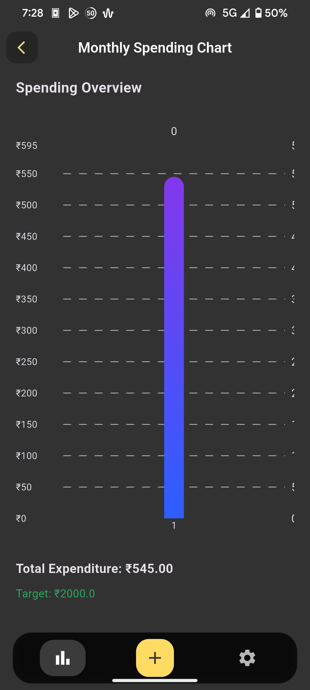
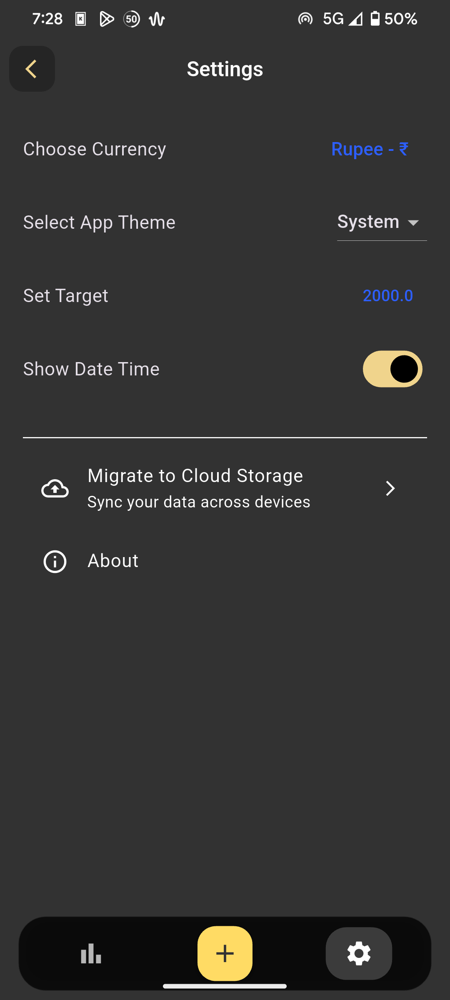
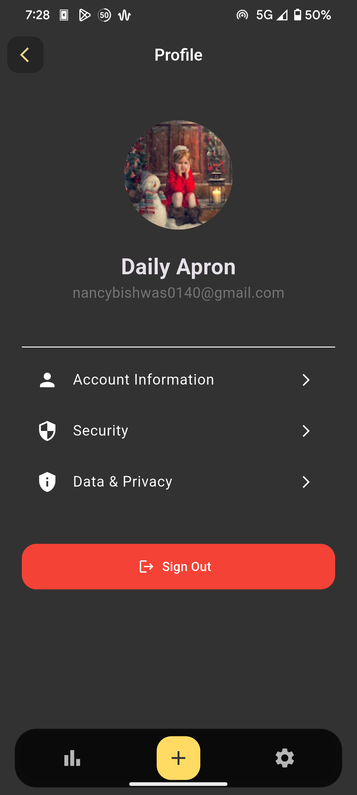

# Expen - Expense Tracker App  

## 📌 Overview  
**Expen** is a lightweight and elegant expense tracker app built with **Flutter**. It helps users manage their expenses efficiently with a clean UI and smooth performance.  

## ✨ Features  
- 📊 **Visual Insights** - View expense charts for better analysis.  
- 🔄 **Set Spending Targets** - Manage your budget effectively.  
- ⏳ **Automatic Date & Time** - No manual input required.  
- 💱 **Multi-Currency Support** - Choose from multiple currencies.  
- 🌙 **Auto Theme Switching** - Supports both light & dark mode.  

## 🛠️ Tech Stack  
- **Flutter** - UI Framework  
- **Provider** - State Management  
- **GoRouter** - Navigation  
- **Hive** - Local Storage  

## 📸 Screenshots  
| Home Screen | Add Expense | Chart Screen |  
|------------|------------|--------------|  
|  |  |  |  

| Settings Screen | About Screen |  
|----------------|-------------|  
|  |  |  

## 🚀 How to Run the Project  
1. Clone the repository:  
   ```bash
   git clone https://github.com/ankit-kr-codes/Expen.git
   ```  
2. Navigate to the project folder:  
   ```bash
   cd expen
   ```  
3. Install dependencies:  
   ```bash
   flutter pub get
   ```  
4. Run the app:  
   ```bash
   flutter run
   ```  


## 📄 License  
This project is licensed under the **MIT License**.  

---  
Made with ❤️ using Flutter.  
